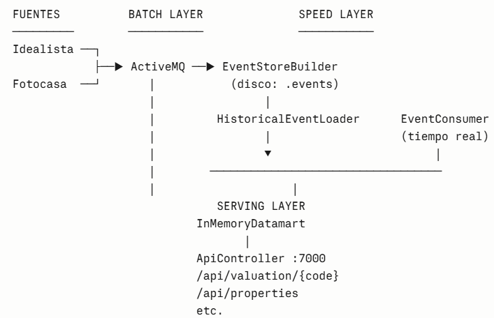
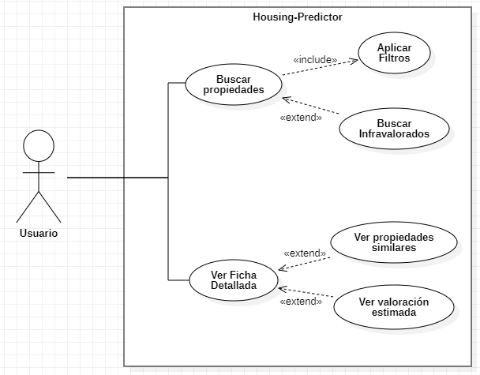

# HOUSING PREDICTOR

En la época actual, comprarse una casa llega a ser un lujo que muchos no se pueden permitir, esto es debido a los excesivos precios que algunas personas le ponen a sus casas de manera subjetiva, sin tener en cuenta el valor real que pueda tener la propiedad.

La idea del proyecto y nuestra propuesta de valor es desarrollar una herramienta con la que se pueda contrastar los precios de venta que hay de las propiedades y compararlas con su precio real para así saber si el precio en los portales de venta son justos o no para los compradores, ya que asi ellos pueden encontrar precios de viviendas infravaloradas y comprar viviendas baratas.

## APIs y Datamart. 
Para realizar el proyecto decidimos usar dos de los canales de compra de propiedades más grandes que hay a nivel global, Idealista y Fotocasa.

Para Idealista aprovechamos la página RapidAPI donde pudimos encontrar la API de manera gratuita y con gran variedad de información y variables que servirían a posteriori en el proyecto. Fotocasa por otra parte, optamos mejor por el uso de un Scraper, pues la API estaba bloqueada para agentes externos, sin embargo con un Scrapper podíamos conseguir también la información que nos sería de utilidad igualando a lo que podíamos sacar de su API.

El datamart son aquellos datos sobre las propiedades que consideramos de mayor valor para la posterior explotación de estos. Se podrían dividir en varios grupos lo cuáles serían:
- Características físicas de la vivienda:
  - Superficie(metros cuadrados).
  - Nº de habitaciones.
- Características geográfica de la vivienda:
  - Ubicación.
  - Zona o Distrito.
- Precio de la vivienda.

El datamart funciona de manera que recoge la información del dataset original, lo procesa y transforma para después seleccionar las variables e insertarlos en nuestro propio dataset analítico. Se decidió esta manera pues así los datos estarían mejor organizados lo que permitiría la posible expansión del datamart en el futuro

## Ejecución y compilación.

### 1 Abrir consola y arrancar ActiveMQ
Obligatorio: ActiveMQ debe estar ejecutándose antes de lanzar cualquier feeder o el EventStoreBuilder.

### 2 Abrir CMD y moverse a la carpeta de ActiveMQ
cd C:\apache-activemq-5.18.3\bin\win64

### 3 Iniciar ActiveMQ
activemq start
Si todo va bien verás:

Código
Apache ActiveMQ started
### 4 Comprobar que ActiveMQ está vivo
Verifica que el broker está funcionando correctamente.

Abrir navegador: http://localhost:8161/admin

Usuario: admin

Contraseña: admin

Si puedes entrar, ActiveMQ está funcionando correctamente.

### 5 Ejecutar EventStoreBuilder
Este módulo escucha los eventos y crea los archivos .events.

Abrir IntelliJ → módulo EventStoreBuilder

Ir a Run → Edit Configurations

En Program arguments poner:

Código
tcp://localhost:61616
Ejecutar la clase Main

Debes ver algo como:

Código
EventStoreBuilder escuchando topics...
### 6 Ejecutar el Main de Fotocasa y el de Idealista
Este Main hace scraping, guarda y publica eventos en ActiveMQ.

IntelliJ → módulo scraper-FotoCasa

Ejecutar la clase Main
Evento publicado (Fotocasa): {...}

Ejecutar también Idealista
Si ejecutas el feeder de Idealista, también generará archivos .events.

IntelliJ → módulo scraper-Idealista

Ejecutar la clase Main
Evento publicado (Idealista): {...}

### 7 Ver los eventos guardados
El EventStoreBuilder crea automáticamente los archivos .events.

Ruta:

Código
EventStoreBuilder/eventstore/Idealista/IdealistaFeeder/
Dentro verás un archivo similar a:

Código
20260509.events
Cada línea del archivo es un evento en formato JSON.

Igual para EventStoreBuilder/eventstore/Fotocasa/FotocasaScraper/

### 8 Iniciar módulo Housing Predictor
Una vez que todo ya ha sido guardado ejecutamos la clase **BusinessUnitApp.java** que se encarga de arrancar todo el proyecto. La API REST y la página web todo en el mismo servidor.

Por defecto se entra en: http://localhost:7000/index.html pero si queremos cambiarnos para ver los datos en la API REST pues debemos cambiarnos a la api: http://localhost:7000/api
Dentro de aqui tenemos varios getters que nos proporcionan la información:

  - Comprobar que la api esta fucionando correctamente: http://localhost:7000/api/ping
  - Obtener el precio promedio de un barrio: http://localhost:7000/api/stats/{neighborhood}
  - http://localhost:7000/api/valuation/{propertyCode}
  - http://localhost:7000/api/neighborhoods
  - http://localhost:7000/api/properties
  - http://localhost:7000/api/properties/{neighborhood}
  - http://localhost:7000/api/property/{propertyCode}
  - http://localhost:7000/api/property/{propertyCode}/full
  - http://localhost:7000/api/property/{propertyCode}/comparables
  - http://localhost:7000/api/valuation/{code}

## Arquitectura del Sistema Lambda
La arquitectura Lambda tiene 3 capas bien definidas. Vamos a mapearlas con tu código:

**<u>Capa Batch (histórica) → EventStoreBuilder + HistoricalEventLoader</u>**

EventStoreBuilder guarda eventos en disco:
- **data/eventstore/Idealista/IdealistaFeeder/20260509/20260509.events**
- **data/eventstore/Fotocasa/FotocasaScraper/20260509/20260509.events**

- Es un append-only log — nunca se modifica, solo se añade
- Al arrancar BusinessUnitApp, el HistoricalEventLoader reprocesa todos los eventos históricos desde cero para reconstruir el estado del datamart
- Eso es exactamente el batch layer de Lambda: almacenar el histórico completo y poder hacer replay

**<u>Capa Speed (tiempo real) → EventConsumer del housing-predictor</u>**

Suscripción en tiempo real a los topics de ActiveMQ
Cada evento nuevo se registra inmediatamente en el InMemoryDatamart
Eso es el speed layer de Lambda: procesar los datos recientes que aún no están en el batch

**<u>Capa Serving → InMemoryDatamart + ApiController</u>**

// InMemoryDatamart fusiona histórico + tiempo real en una sola vista
api.start(datamart);  // expone el resultado unificado

El InMemoryDatamart combina los datos históricos (cargados al inicio) con los nuevos (recibidos en tiempo real)
La REST API en el puerto 7000 sirve esa vista unificada a cualquier cliente
Eso es el serving layer: la capa que responde consultas mezclando batch + speed

¿Por qué NO es Kappa?
| Característica | Tu proyecto | Lambda | Kappa |
| :--- | :---: | ---: | ---: |
| Tiene capa batch separada |  EventStoreBuilder + HistoricalEventLoader | SI | NO
| Tiene capa speed separada |  EventConsumer real-time | SI | SI
| Una sola pipeline de procesamiento |  Tiene dos pipelines distintas | NO | SI
| Replay histórico relanzando la misma pipeline |  Usa HistoricalEventLoader aparte | NO | SI

En Kappa solo existe una pipeline (la de streaming), y si necesitas reprocesar el histórico, simplemente relanzas esa misma pipeline desde el principio del log. En nuestro proyecto, el batch y el speed tienen código y rutas diferentes, lo que es la seña de identidad de Lambda.

Es una implementación Lambda clásica, con la particularidad de que el serving layer es en memoria (no hay base de datos persistente como Cassandra o HBase), lo que es perfecto para un sistema educativo o prototipo donde la velocidad de desarrollo importa más que la persistencia entre reinicios.

## Arquitectura de la Aplicación → Hexagonal
Dentro de cada módulo, especialmente en housing-predictor, se ve un patrón de arquitectura de aplicación:

housing-predictor/ 

├── model/          → Dominio puro (Event, Payload, EvaluationResult)

├── logic/          → Lógica de negocio (BusinessLogic)

├── controller/     → Puertos (Datamart interface, InMemoryDatamart)

├── messaging/      → Adaptador de entrada (EventConsumer ← ActiveMQ)

└── view/           → Adaptador de salida (ApiController → HTTP)

    - BusinessLogic no sabe nada de ActiveMQ, ni de HTTP, ni de disco
    - Datamart es una interfaz (puerto) que desacopla la lógica del almacenamiento
    - EventConsumer y ApiController son adaptadores que conectan el mundo exterior con el núcleo
Resumen

| Nivel      | Pregunta que responde                     | Patrón                 |
|------------|--------------------------------------------|-------------------------|
| Sistema    | ¿Cómo fluyen los datos entre módulos?      | Lambda Architecture     |
| Aplicación | ¿Cómo se organiza el código dentro de un módulo? | Hexagonal Architecture |

Son complementarios, no excluyentes. Lambda describe el macro-diseño del sistema distribuido, y Hexagonal describe el micro-diseño interno de cada aplicación.

### Diagrama de Casos de Uso de la Aplicación

El usuario podrá en la web buscar propiedades y aplicar filtros sobre estas y buscar por infravalorados, de igual forma, si seleccionan una propiedad podrá observar una ficha detallada de todas las características de la propiedad junto con una tabla que contendrá propiedades de características similares , en caso de que existan, y una valoración estimada con la que el usuario podrá saber si el precio de la propiedad es justo, sobrevalorado o infravalorado.

## Principios

Aplicamos SOLID y otros patrones, además de diseñar los feeders como módulos independientes para que se pueda trabajar con cada uno sin que se afecten entre ellos y puedan generar eventos compatibles.

Principios SOLID para el IdealistaFeeder y el EventStoreBuilder:
- SRP: cada clase tiene una responsabilidad única
- OCP: puedes añadir un nuevo feeder sin tocar el existente
- DIP: IdealistaController depende de PropertyFeeder (abstracción), no de IdealistaFeeder directamente

En cambio, para el FotocasaScraper  hay una violación de OCP/DIP respecto a Idealista ya que depende directamente de FotocasaScraperService (clase concreta).

Principios SOLID para el Housing-Predictor:
- SRP: BusinessLogic solo valora, ApiController solo sirve HTTP, InMemoryDatamart solo almacena
- OCP: puedes añadir SQLiteDatamart implements Datamart sin tocar BusinessLogic
- LSP: InMemoryDatamart sustituye a Datamart sin romper el contrato
- ISP: Datamart tiene métodos cohesivos, todos relacionados con el acceso a propiedades
- DIP: BusinessLogic y ApiController dependen de Datamart (interfaz), nunca de InMemoryDatamart (implementación)

## Patrones de diseño

- **Builder:** En la construcción del EventStore o del Datamart. Permite crear estructuras complejas paso a paso, garantizando consistencia en los datos.
- **Repository:** En la business-unit, para acceder al datamart o consultar propiedades. Separa la lógica de negocio del acceso a datos, facilitando pruebas y mantenimiento.
- **Observer:** En la comunicación entre módulos mediante ActiveMQ. Los feeders publican eventos y los consumidores reaccionan automáticamente.
- **Data Transfer Object:** En la API REST y en la capa de negocio. Simplifica el intercambio de datos entre capas sin exponer la lógica interna.

